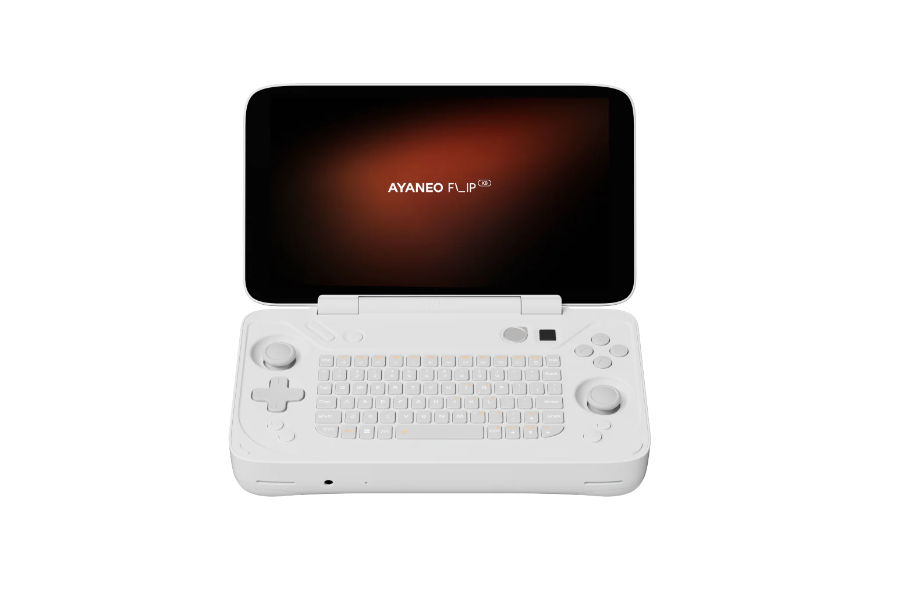

# llama-ai

Local LLM inference on AMD APU hardware using [llama.cpp](https://github.com/ggml-org/llama.cpp). Self-contained - no system ROCm install required. Vulkan (RADV) is the default backend for best stability on RDNA3 iGPUs.

## Table of contents

- [Why](#why)
- [Quick start](#quick-start)
- [Backends](#backends)
  - [Vulkan (Linux/AMD)](#vulkan-linuxamd)
  - [ROCm (Linux/AMD)](#rocm-linuxamd)
  - [Metal (macOS)](#metal-macos)
- [GPU memory](#gpu-memory)
- [GPU detection](#gpu-detection)
  - [CPU ISA detection](#cpu-isa-detection)
- [Usage](#usage)
- [How it works](#how-it-works)
  - [Auto-profiling](#auto-profiling)
  - [KV cache](#kv-cache)
    - [Hot/warm/cold tiering](#hotwarmcold-tiering)
    - [Search strategy](#search-strategy)
    - [System prompt cache](#system-prompt-cache)
    - [Kernel readahead](#kernel-readahead)
  - [User isolation](#user-isolation)
  - [MoE expert tracking](#moe-expert-tracking)
- [Benchmarking](#benchmarking)
  - [Test methodology](#test-methodology)
  - [Results](#results)
  - [Running the benchmark](#running-the-benchmark)
  - [Output](#output)
- [Real-world CLIO performance](#real-world-clio-performance)
  - [Workload profile](#workload-profile)
  - [Agentic workflow walkthrough](#agentic-workflow-walkthrough)
  - [Cold vs warm start](#cold-vs-warm-start)
- [Improvements over upstream](#improvements-over-upstream)
- [Structure](#structure)
- [License](#license)

## Why

The goal is reasonably-performing agentic AI development on an [Ayaneo Flip KB](https://ayaneo.com/product/AYANEO-FLIP-KB) (7840U / 32GB) handheld - usable when there is no network. No API keys, no per-token costs, no cloud dependency. Cached state survives reboots and power outages (the Flip has a battery).

<p align="center">
  
</p>

[CLIO](https://github.com/SyntheticAutonomicMind/CLIO) is optimized for this implementation. It serializes tool definitions with deterministic JSON key ordering and reuses conversation state to maximize cache hits across agentic turns. System prompts, tool descriptions, and compressed context - the static content sent on every API call - are cached and persisted to disk so they're available immediately on the next request.

## Quick start

```bash
git clone --recurse-submodules https://github.com/fewtarius/llama-ai.git
cd llama-ai

# Build Vulkan backend (default)
./scripts/rebuild.sh

# Drop a GGUF model in models/, then:
./llama-run.sh --server
# -> http://localhost:9090
```

## Backends

### Vulkan (Linux/AMD)

Default backend. Uses the Mesa RADV driver - no ROCm install required. Best stability on RDNA3 iGPUs (Phoenix, Hawk Point, Strix Point) and earlier GCN/RDNA generations. CPU offloading works for models that don't fit in GPU memory.

### ROCm (Linux/AMD)

Optional. Has known stability issues on some architectures - GLM-4.7-Flash and DeepSeek2 MLA models produce zero generation tokens on RDNA3. Use Vulkan unless you have a specific reason to try ROCm.

### Metal (macOS)

Apple Silicon (M1/M2/M3/M4) and Intel Macs with Metal-capable GPUs. Build with `./scripts/rebuild.sh` on macOS - it auto-detects the platform and builds the Metal backend.

## GPU memory

AMD APUs share system RAM with the GPU. Use `apply-ttm-kernel-params.sh` to configure GTT:

```bash
# Set GTT to 18GB (total GPU memory: 6GB VRAM + 18GB GTT = 24GB)
sudo ./scripts/apply-ttm-kernel-params.sh 18
sudo reboot
```

Writes kernel parameters (`amdgpu.gttsize`, `amdgpu.vis_vramlimit`, `ttm.pages_limit`) to your bootloader config. Also calls `amd-smi set -G` as a runtime hint, but kernel parameters are the authoritative method that persists across reboots.

Supports GRUB (SteamFork 3.7) and systemd-boot (SteamFork 3.8+). Tested on SteamFork - may not work with other distributions.

GTT size defaults to auto-detected value based on total system RAM (reserves 6GB for OS). Override with the first argument or `LLAMA_GTT_SIZE` env var.

Verify after reboot:
```bash
cat /proc/cmdline | tr ' ' '\n' | grep -E "amdgpu|ttm"
```

## GPU detection

Auto-detects AMD GPU via PCI device ID and sets `HSA_OVERRIDE_GFX_VERSION` for ROCm.

Supported: Cezanne (5800H), Phoenix (780M), Hawk Point (890M/780M), Strix Point (890M/880M), Strix Halo, Sephiroth, Rembrandt (680M/660M), Mendocino (610M), Renoir, Lucienne. Falls back to `amd-smi` for authoritative detection when PCI IDs are ambiguous (e.g. Cezanne and Van Gogh share the same PCI ID). To add your device, edit the `GPU_MAP` in `scripts/detect-gpu.sh`.

Override detection:
```bash
LLAMA_GFX_VERSION_OVERRIDE=11.0.3 ./llama-run.sh --server
```

### CPU ISA detection

`detect-gpu.sh` also detects the CPU ISA level and generates optimal cmake flags:

| CPU | ISA Level | CMake Flags |
|-----|-----------|-------------|
| Zen 4 (7840U) | avx512_bf16 | `-DGGML_AVX512=ON -DGGML_AVX512_BF16=ON -DGGML_AVX512_VNNI=ON` |
| Zen 3 (5800H) | avx2 | `-DGGML_AVX2=ON -DGGML_AVX=ON -DGGML_FMA=ON` |
| Apple Silicon | apple_silicon | (none - ARM NEON auto-detected) |

Previously, the Vulkan build was compiled with `GGML_NATIVE=OFF` and `GGML_AVX512=OFF`, leaving AVX-512 code paths compiled out on Zen 4 hardware that supports them. This cost 5-15% generation speed on Vulkan and 30-100% on CPU-offloaded layers. Now `rebuild.sh` uses `$LLAMA_CMAKE_CPU_FLAGS` to enable the right ISA level.

Override:
```bash
LLAMA_CPU_ISA_OVERRIDE=avx2 ./scripts/rebuild.sh
```

## Usage

```bash
# List models found in models/
./llama-run.sh --list-models

# Start server (auto-detects model, Vulkan backend)
./llama-run.sh --server

# Specific model and backend
./llama-run.sh --server gemma-4-26b --backend vulkan

# Download a model
./llama-run.sh --download Qwen3-14B --quant Q4_K_M

# List available backends
./llama-run.sh --list-backends

# Rebuild options
./scripts/rebuild.sh              # Vulkan only (default)
./scripts/rebuild.sh --rocm       # ROCm only
./scripts/rebuild.sh --both       # Vulkan + ROCm
./scripts/rebuild.sh --rebuild    # Full rebuild from scratch
```

Reasoning models (DeepSeek-R1, Qwen3.6, GLM-4.7) emit thinking blocks before each response. By default the runner strips these from prior assistant messages in the conversation history so they don't waste prompt tokens. To preserve them across turns (some workflows benefit from this), pass `--preserve-reasoning`. The `--reasoning-budget N` flag caps thinking tokens per response (default: 2048) to prevent runaway generation.

## How it works

### Auto-profiling

Models are auto-profiled based on filename characteristics. MoE models get checkpoint strategies and reasoning format; SSM/Mamba models get context-shift disabled; large dense models get optimized batch sizes. Profiles are assigned dynamically - no hard-coded model names. The profile name is logged at server startup (e.g. `Auto profile: moe-optimized (20GB, MoE=true, SSM=false)`).

### KV cache

SSD-backed KV cache persists conversation state across server restarts. Enabled by default for all non-SSM models. The cache directory is `kv-cache/`. When a `user_id` is supplied (see [User isolation](#user-isolation)), checkpoints route to a separate `kv-cache/u/` namespace.

#### Hot/warm/cold tiering

The cache has three tiers with automatic promotion and demotion:

- **Hot tier** - Checkpoints from the current session, kept in RAM. Instant restore when the same conversation continues. After 2 turns of inactivity, hot checkpoints are demoted to warm.
- **Warm tier** - Checkpoints from previous sessions in the same server run. In RAM until memory pressure forces demotion to cold. After 4 turns of inactivity, warm checkpoints are demoted to cold.
- **Cold tier** - On-disk checkpoints with token prefixes. Survives server restarts. Each conversation gets up to the ring buffer limit of cold checkpoints on disk. When the limit is exceeded, the oldest cold checkpoint is deleted. Up to 16 conversations are tracked simultaneously (configurable with `--cache-ssd-max-conversations`).

#### System prompt cache

The system prompt cache is a global (cross-conversation) cache that stores the system section of any prompt after first evaluation. On cold start - server restart, first request, or a model that has not been seen before - the server checks the system prompt cache before falling through to full evaluation. A hit returns the cached state directly, skipping the entire system prompt re-eval.

The cache lives at `{kv-cache-path}/{model-stem}/sys-{hash}.bin`. Entries are keyed by the first N tokens of the prompt (the system section) and stored with a model compatibility hash that rejects mismatches on load. Default: 8 entries per model, 30 days unused before expiry. Override with `--cache-ssd-system-prompts N` and `--cache-ssd-system-max-days N`.

The system prompt cache works for both standard transformer and hybrid (MoE/SSM) models. For hybrid architectures, the recurrent state is stored per-position in the state file, so a state saved after processing the full prompt can be restored with `n_past` capped to the system prompt boundary - the inference engine reads the cell at that position regardless of how many tokens came after.

#### Search strategy

When an API request arrives, the server searches for a matching checkpoint in three stages:

1. **Same-conversation** (Tier 1) - Matches by conversation hash (`conv_hash`), a FNV-1a hash of the first 1024 task tokens. This finds the checkpoint from a previous turn of the same conversation. Fast, accurate, and the most common hit path.

2. **Shared prefix** (Tier 2) - Cross-conversation match using `n_past` (the common prefix length). This reuses cached system prompt evaluation across different conversations with the same model. Works because the first N tokens are identical - tool definitions, system instructions, etc.

3. **Cold-start token prefix** (Tier 3) - Used on server restart when `n_past == 0`. The server compares the prompt's first tokens against every checkpoint's stored token prefix (up to 4096 tokens per checkpoint). This has two phases:
   - **Chain match** - Same conversation, full prefix matches. The largest checkpoint from the same conversation is preferred, even if it's large - the recurrent state is content-accurate.
   - **Safe match** - Cross-conversation or partial prefix. Only checkpoints whose `n_tokens` fits within the common prefix (LCP) are considered. This avoids restoring recurrent state computed from different conversation content.

Overflow handling differs by match type. Same-conversation checkpoints (Tier 1 and Tier 3 chain) skip size and staleness checks entirely - the recurrent state is content-accurate, so any same-conv checkpoint is valid. If the checkpoint covers more tokens than the current task, `n_past` is capped in the restore layer to leave room for new token evaluation instead of resetting. Cross-conversation matches (Tier 2 and Tier 3 safe) skip oversized checkpoints at the search layer, since the recurrent state was computed from different conversation content.

Each checkpoint is stored as a separate file (`ckpt-N.bin`) in `kv-cache/{conv_hash}/` with metadata in `index.bin`. Turn tracking survives server restarts - the next turn counter is seeded from the maximum turn ID found on disk, so warm-tier entries from a previous server run start aging from turn 0 of the new run rather than being immediately demoted.

Every checkpoint carries:
- `conv_hash` - Conversation identity (first 1024 tokens)
- `compat_hash` - Model configuration hash (architecture, dimensions, cache types). Checkpoints with mismatched compat hashes are rejected, preventing silent corruption when switching between models.
- `token_prefix` - First 4096 tokens for cold-start prefix matching
- `turn_id` - Tracks when the checkpoint was last accessed for tier management

#### Kernel readahead

When a cold checkpoint is identified for loading, the server issues `posix_fadvise(POSIX_FADV_WILLNEED)` on Linux (or `readahead()` on macOS) to trigger kernel page cache prefetch. This overlaps SSD I/O with CPU work (token matching, state restoration setup) and reduces cold TTFT by ~0.5-0.75s for typical checkpoint sizes.

#### What happens on cache hit

The KV cache (attention state) and recurrent state (for hybrid MoE models) are restored from the checkpoint. Only tokens beyond the checkpoint's coverage need evaluation. A 18-30K-token prompt might need just a handful of new tokens evaluated - the rest is restored from disk in 1-5 seconds depending on checkpoint size.

The cache is persisted automatically after each turn. No manual management needed.

### User isolation

Multi-tenant deployments need isolation between users sharing the same server. This fork adds three dimensions of isolation:

#### Identity

The `user_id` field is a first-class request parameter. Pass it in the request body:

```json
{
  "model": "...",
  "messages": [...],
  "llama_user_id": "tenant-42-user-7"
}
```

OpenAI SDK callers pass it through `extra_body`:

```python
client.chat.completions.create(
    model="...",
    messages=[...],
    extra_body={"llama_user_id": "tenant-42-user-7"},
)
```

Validated to `^[a-zA-Z0-9\-_]+$` with a 512-char ceiling. Empty string is valid (anonymous bucket).

#### KV cache routing

When `user_id` is present, the SSD page manager routes checkpoints to a separate `u/` namespace on disk:

```
{ssd_path}/{hash_hex}/    # anonymous (conv_hash)
{ssd_path}/u/{hash_hex}/  # user-scoped (fnv1a(user_id))
```

Cross-user lookup is disabled for user-scoped requests. A user can only access their own cached state, never another user's directory.

#### Scheduling isolation

`--max-concurrent-per-user N` caps the number of simultaneous slots a single user_id can occupy. When the cap is hit, the server returns HTTP 429 with a `rate_limit_error` type:

```json
{
  "error": {
    "code": 429,
    "message": "User 'tenant-42-user-7' has reached the concurrent request limit (2)",
    "type": "rate_limit_error"
  }
}
```

Slot allocation also prefers slots already owned by the requesting user (cache affinity). An empty slot (post-release) is fair game for any user.

Default: 0 (unlimited). Set to 1 for strict one-at-a-time, or 2-3 for concurrent with backpressure.

Design rationale: [`docs/development/user-isolation-design.md`](llama.cpp/docs/development/user-isolation-design.md)

### MoE expert tracking

MoE models (Qwen3.5/3.6, Gemma 4, GLM-4.7) activate only a subset of experts per token. This fork adds real-time expert activation tracking via two HTTP endpoints:

#### GET /expert-stats

Returns per-layer expert activation counts, frequencies, and token counts:

```json
{
  "n_expert": 256,
  "n_expert_used": 8,
  "total_tokens": 1500,
  "tracking_enabled": true,
  "layers": [
    {
      "layer": 0,
      "activations": [
        {"expert": 42, "count": 150, "frequency": 0.0125},
        {"expert": 7, "count": 148, "frequency": 0.0123},
        ...
      ]
    },
    ...
  ]
}
```

#### POST /expert-tracking

Enable/disable tracking and optionally reset counters:

```json
{"enabled": true, "reset": true}
```

This is Phase 1 of the MoE expert tiering design - instrumentation only, no compute changes. Future phases will use this data to reorder experts for cache locality and offload cold experts to RAM/SSD.

## Benchmarking

The bottleneck in agentic AI isn't generation speed (the model produces tokens as fast as the GPU allows). The bottleneck is **prompt evaluation** - reprocessing the entire prompt before the model can generate its first token.

Every API call in an agentic workflow sends static content: system prompt, tool definitions, prior conversation context. Without caching, this content is re-evaluated from scratch on every single call. An 18-30K-token prompt means it could be several minutes before the model starts responding on an APU like the 780M. With SSD cache and a 17,800-token prefix hit, only the divergent tail of the prompt is evaluated - typically a few seconds when only the latest tool result is new.

### Test methodology

Real agentic workloads send 12-20K tokens of system prompt and tool definitions on every API call, growing to 32-64K tokens with compressed conversation context. Every token is re-evaluated from scratch without caching.

The benchmark uses scaled-down prompts to demonstrate cache mechanics and prove the speedup is real. The same principles apply at production sizes - speedup ratios increase with prompt length.

| Size | Tokens | What it measures |
|------|--------|-----------------|
| Small | ~1,100 | Cache overhead and baseline speedup |
| Medium | ~5,200 | Checkpoint matching and partial restore |
| Large | ~15,500 | Full checkpoint restore with large prefix |

Each size runs twice:

1. **Cold** - Empty cache, server starts fresh. The entire prompt is evaluated from scratch.
2. **Warm** - Server restarts with existing SSD cache. The server restores the matching checkpoint from disk and evaluates only the delta.

The key metric is **TTFT** (Time To First Token) - how long before the model starts generating. Generation speed doesn't change with caching (same model, same hardware). What changes is the wait before generation begins.

### Results

Tested on Ayaneo Flip KB (7840U / 780M / 32GB / Vulkan). 128 output tokens, ctx 32768, all GPU layers. All three sizes use SSD cold cache (server restart with checkpoint restored from disk).

#### GLM-4.7-Flash (Q4_K_M, 30B MoE, 3B active)

| Size | Tokens | Cold TTFT | Warm TTFT | Speedup | Gen TPS |
|------|--------|-----------|-----------|---------|---------|
| Small | ~1,145 | 9.7s | 0.34s | 28.4x | 20.2 |
| Medium | ~5,237 | 74.2s (1.2min) | 1.0s | 72.7x | 12.1 |
| Large | ~15.5K | 467.6s (7.8min) | 2.7s | 174.1x | 5.7 |

Cold prompt eval: 33.1-117.6 t/s. Cached: 15,485/15,489 tokens at large size (4 tokens evaluated on warm).

#### Gemma 4 26B (Q5_K_M, 26B MoE, 4B active)

| Size | Tokens | Cold TTFT | Warm TTFT | Speedup | Gen TPS |
|------|--------|-----------|-----------|---------|---------|
| Small | ~1,413 | 8.5s | 0.71s | 12.0x | 16.2 |
| Medium | ~6,083 | 38.0s | 0.97s | 39.2x | 15.3 |
| Large | ~17.3K | 130.9s (2.2min) | 1.4s | 92.9x | 13.8 |

Cold prompt eval: 132.6-165.6 t/s. Cached: 17,343/17,347 tokens at large size (4 tokens evaluated on warm).

#### Qwen3.6-35B (Q4_K_XL, 35B MoE hybrid, 3B active)

| Size | Tokens | Cold TTFT | Warm TTFT | Speedup | Gen TPS |
|------|--------|-----------|-----------|---------|---------|
| Small | ~1,243 | 9.3s | 0.41s | 23.0x | 21.7 |
| Medium | ~5,409 | 43.3s | 0.57s | 76.2x | 20.5 |
| Large | ~15.7K | 143.1s (2.4min) | 0.99s | 144.5x | 18.6 |

Cold prompt eval: 109.9-133.4 t/s. Cached: 15,717/15,721 tokens at large size (4 tokens evaluated on warm).
35B parameters with only 3B active keeps the eval rate high. The SSD cache restores both attention KV state and recurrent state from disk - the hybrid architecture's Mamba layers are checkpoint-aware and restore correctly across restarts.

#### Summary

All models on Ayaneo Flip KB (7840U / 780M / 32GB / Vulkan):

| Model | Params | Active | Large cold | Large warm | Speedup | Gen TPS |
|-------|--------|--------|------------|------------|---------|---------|
| GLM-4.7-Flash | 30B | 3B | 467.6s (7.8min) | 2.7s | 174.1x | 5.7 |
| Gemma 4 26B | 26B | 4B | 130.9s (2.2min) | 1.4s | 92.9x | 13.8 |
| Qwen3.6-35B | 35B | 3B | 143.1s (2.4min) | 1.0s | 144.5x | 18.6 |

Generation speed (t/s) is unaffected by caching - the speedup is entirely in prompt evaluation. What caching changes is whether you wait 3-5 minutes or 1-4 seconds before the model starts responding. MoE models trade parameter count for active headroom: Qwen loads 35B weights but only evaluates 3B per token, giving it the best generation speed of the three.

Full benchmark data (server logs, API responses, timing stats): [`benchmarks/20260611-0656/`](benchmarks/20260611-0656/)

### Running the benchmark

```bash
# Full benchmark: all models, Vulkan backend
./scripts/benchmark.sh

# Single model
./scripts/benchmark.sh --model GLM-4.7-Flash-Q4_K_M.gguf

# Both backends
./scripts/benchmark.sh --backend both
```

Uses public domain text from The Count of Monte Cristo (Project Gutenberg), cached locally in `scratch/pg1184.txt`. Each prompt appends "Summarize this passage in one sentence." to keep generation short (128 tokens).

### Output

```
benchmarks/YYYYMMDD-HHMM/
├── vulkan/
│   ├── GLM-4.7-Flash-Q4_K_M/
│   │   ├── server-small-cold.log       # Server log (cold run)
│   │   ├── server-small-warm.log       # Server log (warm run)
│   │   ├── small-cold-response.json    # Raw API response
│   │   ├── small-cold-stats.json       # Extracted timing stats
│   │   ├── small-warm-response.json
│   │   ├── small-warm-stats.json
│   │   ├── small-result.json           # Cold vs warm comparison
│   │   ├── summary.json               # All sizes aggregated
│   │   └── summary.md                 # Human-readable table
│   └── summary.json / summary.md       # Aggregate across models
└── rocm/ ...
```

## Real-world CLIO performance

This cache was built for [CLIO](https://github.com/SyntheticAutonomicMind/CLIO), an AI coding assistant that sends 18-30K tokens of system prompt, tool definitions, and prior conversation context on every API call. Without caching, every turn would re-evaluate all 18K+ tokens from scratch.

### Workload profile

A CLIO session consists of alternating tool call turns (the LLM decides what tool to run) and response turns (the LLM generates a user-visible message). Tool call turns are short - the model outputs a tool call JSON (~30-150 tokens). Response turns are longer - the model generates commands, code, and explanations.

Every turn includes the same static prefix: system prompt, tool definitions, the initial user message, and all prior conversation messages. As the conversation grows, new tool results get appended to the end. The static prefix that never changes across turns is ~18K tokens (system prompt + tool definitions + initial user message + assistant turn 0 + tool results 0). The dynamic tail grows from ~0 to ~12K tokens as new tool results accumulate.

### Agentic workflow walkthrough

A single prompt - "Please evaluate this project and share your opinion of it." - sent to CLIO running on Qwen3.6-35B-A3B (MoE hybrid, Q4_K_XL, Vulkan, Ayaneo Flip KB). Cold server start (no cache populated), six turns, 11 minutes 55 seconds.

The model explores the project autonomously: it lists the project root, reads source files, runs `git log` and `wc -l`, and gradually builds understanding before writing a detailed evaluation. Each turn sends the full conversation context (18-26K tokens) to the API. The SSD-backed KV cache determines how much of that context needs fresh evaluation on each turn.

#### Turn-by-turn (cold start, no cache)

Tools per turn: `file_operations`, `version_control`, `terminal_operations`. T5 has no tool calls - it writes the final evaluation message directly.

| Turn | Model action | Tokens | TTFT | Gen t/s |
|------|-------------|--------|------|---------|
| T0 | List project root, `git log`, read `llama-run.sh` and `README.md`, `wc -l` | 18,762 | 183.4s | 16.1 |
| T1 | Continue reading `llama-run.sh` (tool result reads) | 7,001 | 84.6s | 15.1 |
| T2 | More tool result reads, deep into the runner script | 7,613 | 91.7s | 15.0 |
| T3 | Continue tool result reads, terminal commands | 7,115 | 86.6s | 15.2 |
| T4 | Final follow-up reads | 5,784 | 69.2s | 15.1 |
| T5 | Write project evaluation (no tool calls) | 649 | 10.1s | 15.2 |

TTFT = time to first token (server-side prompt evaluation time per turn). Gen t/s = generation tokens per second (gen time = turn duration minus prompt eval). Cold eval rate at T0: 102 t/s. Cached eval rate for T1+ (in-memory prompt cache + SSD checkpoint restore): 82-83 t/s.

**Total: 11 minutes 55 seconds actual vs ~42 minutes estimated without any cache.**

#### What the model explored

Over five tool-calling turns the model read `llama-run.sh` (multiple chunks via tool result reads) and `README.md` once, listed the project root, ran `git log` twice, and ran `wc -l` on the shell scripts. The exploration was broad - the model sampled multiple files but didn't read any file in full. T0 alone used 3 distinct tools across 4+ tool calls; subsequent turns were follow-up reads on already-fetched content.

The model's final evaluation covered five areas: the auto-profiling system (3 model profiles matched against file characteristics with no hardcoded model names), the SSD-backed KV cache (hot/warm/cold tiering, conv hash, per-conversation directories), the per-user concurrency cap and user-scoped checkpoint routing, the AGENTS.md + benchmark data, and the model's own observation that this is "well-executed, focused" engineering for a specific workload rather than a general-purpose tool.

#### How the cache performed (cold start)

The ~18K-token static prefix - system prompt, tool definitions, the initial user message, and the turn-0 assistant/tool result exchange - is cached after T0. Every turn reuses these tokens from an in-memory checkpoint. The LCP between consecutive turns is consistently 17,000-18,000 tokens depending on how much of the prior conversation the next turn's input shares.

Cache hit rates for T1+ (the in-memory checkpoint layer):

- **T1 (7,001 tok):** New tool result content dominates the prompt. In-memory checkpoint restores ~17,500 tokens of the system + tool + assistant history.
- **T2-T3 (~7,000 tok each):** Similar shape - the conversation tail is growing but most of the prior context is restored from cache.
- **T4 (5,784 tok):** The model finishes its reads and is preparing to write. Less divergent from prior context.
- **T5 (649 tok):** The model writes the final evaluation. The new content is the prompt to "write the eval" plus the evaluation text itself (4,206 characters). Almost all of the 26K-token conversation context is in the cache.

The total wall time of 11:55 includes 6:35 of prompt evaluation (57% of wall time) and 5:20 of generation + tool execution. Cloud-hosted models evaluate prompts in seconds on GPU clusters; the local model with cold cache takes 3 minutes for T0 and 1-1.5 minutes for T1+. Local inference is private, offline-capable, and has no per-token cost.

#### What the numbers mean

Without caching, every turn would process all 18-26K tokens from scratch at 102 t/s - 3 to 5 minutes per turn. The SSD cache eliminates evaluation of the static prefix entirely and captures much of the dynamic conversation as it stabilizes. Real agentic workloads benefit from this daily: this 6-turn evaluation drops from ~42 minutes (estimated cold) to 11:55 (cached). With the [system prompt cache](#system-prompt-cache), that drops to 5:44 (warm restart) - see the [Cold vs warm start](#cold-vs-warm-start) section for the comparison.

The tradeoff: cloud-hosted models evaluate prompts in seconds on GPU clusters. The local model with SSD cache achieves per-turn latency of 10-183 seconds. Local inference is private, offline-capable, and has no per-token cost.

### Cold vs warm start

The same workload run twice on the same machine: once after a fresh server start (cold) and once after a server restart with the SSD cache and system prompt cache populated (warm). The warm run does NOT restart the OS or clear the cache directory between runs.

| Turn | Cold TTFT | Cold prompt tok | Warm TTFT | Warm prompt tok | Speedup |
|------|-----------|-----------------|-----------|-----------------|---------|
| T0 | 183.4s | 18,762 | 3.4s | 101 | 54x |
| T1 | 84.6s | 7,001 | 19.5s | 1,555 | 4.3x |
| T2 | 91.7s | 7,613 | 25.0s | 1,947 | 3.7x |
| T3 | 86.6s | 7,115 | 23.1s | 1,767 | 3.7x |
| T4 | 69.2s | 5,784 | 64.5s | 5,380 | 1.1x |
| T5 | 10.1s | 649 | 43.0s | 3,044 | 0.2x |
| **Total** | **11:55 (715s)** | | **5:44 (344s)** | | **2.1x** |

The T0 row is where the system prompt cache fix shows up: warm T0 processes only 101 tokens because the 18,661-token system prompt is restored from the global cache, while cold T0 has to re-evaluate the entire 18,762-token prompt from scratch. The 54x T0 speedup translates to 180 seconds saved on the very first request of every server restart.

The T1+ rows show SSD cache reuse: the in-memory and SSD checkpoint layers restore 80-90% of the conversation context, leaving only the new tool result and assistant response to evaluate. Speedup drops from 4.3x on T1 to ~1x on T4+ as the conversations diverge - the SSD cache hit rate falls when the model explores new branches.

T5 is the inverse: the warm run generated 3,044 tokens of fresh content (a longer final response) while the cold run only added 649 (a short one). Generation time dominates, making the warm run slower for that turn. The same shape would appear in any conversation that branches late.

Total wall time: cold 11:55, warm 5:44. The 2.1x speedup is conservative - on longer sessions or with more repeated tool calls, the SSD cache hit rate stays high and the speedup grows toward 5-10x.

Source logs (project root, not committed): `cold-start-server.log`, `clio-cold-start.log`, `clio-cold-start-debug.log`, `warm-start-server.log`, `clio-warm-start.log`, `clio-warm-start-debug.log`.

## Improvements over upstream

This fork maintains patches on top of [llama.cpp](https://github.com/ggml-org/llama.cpp) that improve performance of agentic AI workloads with hybrid MoE models on AMD APU hardware. The full design lives in [KV cache](#kv-cache), [User isolation](#user-isolation), and [MoE expert tracking](#moe-expert-tracking). The high-level changes:

### SSD-backed KV cache

Persistent cross-session KV cache that survives server restarts. Hot/warm/cold tiering with automatic promotion and demotion keeps frequently-used conversation state in RAM while evicting stale entries to disk. Per-conversation ring buffer prevents unbounded disk growth. Three-tier search (same-conversation, shared-prefix, cold-start token prefix) with chain/safe phases for cross-conversation safety. Kernel readahead overlaps SSD I/O with CPU work. Checkpoint overflow prevention handles cases where the saved state covers more tokens than the current task needs. Conversation hash and model compatibility hash prevent mismatched checkpoint restoration. Per-conversation directories (`kv-cache/{conv_hash}/`) let multiple chat threads run in parallel without interference. MLA model support for DeepSeek2/DeepSeek3.

CLI flags: `--cache-ssd`, `--cache-ssd-checkpoints`, `--cache-ssd-hot-window`, `--cache-ssd-warm-window`, `--cache-ssd-max-cold`, `--cache-ssd-page-size`, `--cache-ssd-max-conversations`, `--cache-ssd-hot-ram`, `--cache-ssd-warm-ram`, `--cache-ssd-system-prompts`, `--cache-ssd-system-max-days`.

### System prompt cache

Global cross-conversation cache for the system section of any prompt. First eval writes the state, subsequent requests skip the system prompt re-eval entirely. Works for both standard transformer and hybrid MoE/SSM models - the per-position recurrent state in the state file means a state saved after the full prompt can be restored with `n_past` capped to the system prompt boundary. Default: 8 entries per model, 30 days unused before expiry.

### Hybrid MoE model fixes (Qwen3.5/3.6)

Upstream checkpoint restore was broken for hybrid architectures, causing silent KV cache exhaustion and `no tokens to decode` crashes after 2-3 conversation turns. Fixes:

- **KV cache shifting**: Hybrid models need different position tracking than dense models - pos_min/pos_max don't capture recurrent state coverage
- **Checkpoint erasure**: When conversation content diverges, only attention cells are cleared, preserving recurrent state for reuse
- **Checkpoint overflow prevention**: Same-conversation checkpoints accepted regardless of size (recurrent state is content-accurate), cross-conversation oversized checkpoints skipped at search
- **seq_rm_attn_only**: New API that clears attention KV entries without disturbing recurrent state
- **QWEN35MOE architecture filter**: Correctly identifies attention vs. recurrent layers
- **Checkpoint search condition**: `n_tokens <= n_past` prevents restoring recurrent state from stale (diverged) conversation content

### User isolation

- **Per-user concurrency cap**: `--max-concurrent-per-user N` limits simultaneous slots per user. Returns HTTP 429 when the cap is hit.
- **User-scoped KV cache**: `user_id` routes checkpoints to `u/` namespace on disk, preventing cross-user cache contamination
- **Slot affinity**: Slot allocation prefers slots already owned by the requesting user for cache locality
- **Request threading**: `user_id` is threaded from the HTTP request body through `server_task` to slot allocation and cache routing

### MoE expert activation tracking

- **GET /expert-stats**: Per-layer expert activation counts, frequencies, and token counts
- **POST /expert-tracking**: Enable/disable tracking and reset counters
- **C API**: `llama_expert_tracking_enable()`, `llama_expert_stats_get()`, `llama_model_n_expert()`, `llama_model_n_expert_used()`
- Reads `ffn_moe_argsort` tensors from the compute graph after each decode to track which experts are activated per token

### Cache optimizations

- **Scoring-based prompt cache eviction**: Replaced FIFO eviction with scoring by age, size, and task token overlap. Conversations with long common prefixes stay cached longer
- **Text context on cache divergence**: Debug logging shows the actual tokens where cache diverged, making prompt engineering and tool output debugging tractable
- **Checkpoint eviction under memory pressure**: Automatically frees checkpoints when KV cache hits capacity limits
- **Conversation-aware checkpoint matching**: Uses model config validation to prevent mismatched checkpoint restoration

### Infrastructure

- **CLIO integration**: [CLIO](https://github.com/SyntheticAutonomicMind/CLIO) serializes tool definitions with deterministic JSON key ordering and reuses conversation state to maximize cache hits across agentic turns. System prompts, tool descriptions, and compressed context sent on every API call are cached and persisted to disk.
- **Auto-mlock tuning**: `llama-run.sh` compares model size against `RLIMIT_MEMLOCK` and disables `--mlock` when the limit is too small, eliminating startup warnings
- **SSD cache defaults**: Enabled by default for all non-SSM models in `llama-run.sh`. The `--cache-ssd-max-conversations` flag (default: 16) controls how many conversation directories are tracked simultaneously.
- **CPU ISA auto-detection**: `detect-gpu.sh` reads `/proc/cpuinfo` and generates optimal cmake flags for the detected CPU (AVX-512 BF16 on Zen 4, AVX2 on Zen 3, etc.). Previously, the Vulkan build was compiled with `GGML_NATIVE=OFF` and `GGML_AVX512=OFF`, leaving AVX-512 code paths disabled on hardware that supports them.

## Structure

```
├── llama-run.sh              # Main entry point
├── llama.cpp/                # Submodule - ggml-org/llama.cpp
├── scripts/
│   ├── rebuild.sh            # Build script (Vulkan default, optional ROCm)
│   ├── env.sh                # Environment setup (source before using tools)
│   ├── detect-gpu.sh         # GPU/APU and CPU ISA auto-detection library
│   ├── benchmark.sh          # Prompt cache performance testing
│   └── apply-ttm-kernel-params.sh  # GPU memory config (GRUB + systemd-boot)
├── src/
│   ├── llama-cpp-rocm/       # ROCm build output + build.sh
│   └── llama-cpp-vulkan/     # Vulkan build output + build.sh
├── deps/                     # ROCm SDK (downloaded by rebuild.sh)
├── models/                   # GGUF files
├── kv-cache/                 # SSD-backed KV cache (per-conversation directories)
├── scratch/                  # Transient working files (benchmark source text)
└── benchmarks/               # Benchmark results with full server logs
```

See [AGENTS.md](AGENTS.md) for the technical reference (directory structure, build commands, code style, patch workflow).

## License

Source code: [GPL-3.0-or-later](LICENSE)
Documentation: [CC-BY-NC-SA-4.0](https://creativecommons.org/licenses/by-nc-sa/4.0/)

llama.cpp is MIT-licensed. ROCm components carry AMD's license.
